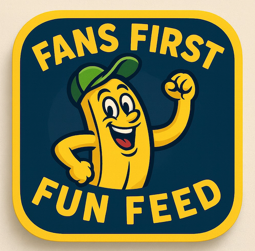

# Fans First Fun Feed (FRONTEND)

**LINK TO BACKEND GITHUB REPO:** https://github.com/SylviaRemington/fans-first-fun-feed-backend

  

This app is a **MERN stack app** for **Savannah Bananas** fans.

**Savannah Bananas is an alternative baseball team known for dances, trick plays, and fan engagement**. 

# **Inspiration** 
(inspiration and thoughts behind creating this app / background info about the app & why I built it.)

**Inspiration Behind Fans First Fun Feed**
The Fans First Fun Feed was inspired by attending two Savannah Bananas games at the beginning of February 2025! These baseball games/shows are unlike anything else in the world. The experience is an awesome blend of baseball, dance, singing, fun games for the fans with incredible kindness from everyone involved. You meet the players before the game and the owner after, creating a sense of community. This is how I imagine the world being... a world filled with kindness where everyone is kind, caring, and joyful with one another. This app lets fans share and celebrate these special moments/memories together.

The initial idea was for it to be called: The Banana Fan Dance and Moment Share App. 

- Live fans will be able to add dance moves (name, type) to perform at games; while both live and online fans will be able to share favorite, awesome moments from the game (text, category like trick plays, dance moves, or Dad-bod-cheer-squad) inspired by game events or IG videos. 

- All entries will appear in a community feed for everyone to view and like. 

- This is a way to bring fans together in a simple, list-based interface!

This app will, most likely, be simplified a lot; and start out as a way for fans to share great, fun moments from the game. Once I have that CRUD functionality accomplished, I will move on to creating the dance move part of it. That will be more for a stretch goal; and this stretch goal portion may be accomplished after the Project 3 deadline (since we only have a week to create a full stack app with both BACKEND and FRONTEND).

**Thus, to recap:**  
**I’ll build an Express API that serves as the BACKEND for a full-stack "moment-sharing" application called Fans First Fun Feed. Within this Express API, I’ll implement full CRUD functionality and test it with Postman.**

# **App Description and Functionality**

Fans First Fun Feed is a MERN stack application designed for Savannah Bananas fans to share and engage with memorable moments from Banana Ball baseball games! Inspired by the vibrant community-spirit of the Savannah Bananas and what they create at their games/shows/events, the app allows users to connect by posting, viewing, updating, and deleting "Fun Moments" (e.g., trick plays, cool dances, mascot antics, etc.) and commenting on them. 

### Key features include:

- **User Authentication:** Secure sign-up and sign-in with JWT-based authentication, ensuring only registered users can create, edit, or delete content.

- **Fun Moment CRUD:** Authenticated users can create "Fun Moments" with a title, text, and category (e.g., Trick Plays, Cool Dances), view a list of all Fun Moments, update their own Fun Moments, and delete them from the details page.

- **Comment System:** Users can add comments to Fun Moments, edit their own comments via a dedicated pre-filled form, and delete their comments, fostering community interaction.

- **Responsive UI:** Built with React and styled with CSS, the app features a cohesive design with WCAG-compliant contrast (e.g., dark text on yellow backgrounds, blue-bordered buttons), using Flexbox for layout and Vite for fast development.

- **Navigation:** React router enables navigation between landing, dashboard, sign-in/sign-up, Fun Moments list, details, and create/edit pages. You can signup (aka register your own account) / sign in, view funmoments, create funmoments, update funmoments, delete funmoments, and be able to comment on funmoments.

**The app was built to bring fans together to celebrate and share their unique, fun experiences at Savannah Bananas events, with a stretch goal to add features like dance move uploads, tutorials and likes.**

# Tech Stack
**Back End**
- Node.js + Express.js - server
- MongoDB + Mongoose - the database and "models" layer
- JWT auth template - signup / signin / protected routes
- dotenv
- CORS - lets frontend talk to backend
- Postman - testing my routes (e.g. get, create, update, delete)

**Front End**
- React (vite) - the app framework and dev server
- React Router - pages and navigation for multiple screens
- Axios - calls my Express API
- CSS - styling
- Auth token storage

**Deployment**
- Will be deploying with Heroku (General Assembly Student set up) for backend & Netlify for front end.

# **Getting started** 
-- a link to my planning materials or info about it & a link to my backend

# **Tech / Technologies Used**

# **Attributions** 
-- includes any external resources such as libraries or assets - but can leave this out if not applicable.

# Rough Drafts & beginning version of projects

# Wireframes 
-- showing screenshot of frontend and backend vscode folders

# Tree 
-- showing screenshot of frontend and backend tree

# **Next Steps/Future Enhancements**

# **Stretch Goals**

### About Express API JWT Auth Template:
My Express API will make use of the Express API JWT Auth Template. This template provides this Express application with pre configured JWT Authentication. This style of authentication in HTTP uses tokens, or unique identifier strings, to tell who a user is when they’re making an authenticated request.

Thus, this Express application will be able to sign up and sign in users. Additionally, it includes a verifyToken middleware function. The verifyToken middleware ensures that any route following it in the middleware pipeline will require authentication before proceeding.

To demonstrate JWT Authentication, my Express application will use verifyToken to protect all routes related to the hoot resource. This means users will be required to sign in before getting access to any Fans First Fun Feed data.

## User stories

**Below are the user stories I will implement within my FunMoment:**

- As a guest, I should be able to create an account.
- As a new user with an account, I should be able to log in to my account.
- As a user, I should be able to create a funmoment post.
- As a user, I should be able to see a list of all funmoments on a ‘List’ page.
- As a user, clicking on a funmoment in the ‘List’ page should navigate me to a funmoment’s ‘Details’ page to view information about a single funmoment post and its associated comments.
- As a user, I should be able to add a comment on a funmoment’s ‘Details’ page.
- As the author of a funmoment, I should see a link to ‘Edit’ a funmoment on the ‘Details’ page. Clicking on the link should direct me to an ‘Edit’ page where I can modify the funmoment. Upon submitting the update, I should be redirected back to the ‘Details’ page.
- As the author of a funmoment, I should see a button to ‘Delete’ a funmoment on the ‘Details’ page. Clicking the button should delete the funmoment and redirect me back to the ‘List’ page.

**The above user stories give me a good idea of what CRUD operations a user might want to perform in my app, and I will be coding accordingly to these User Stories.**

## Component hierarchy diagram
- After reviewing the user stories, my next step is to map out the component structure of my React app. For this, I’ll utilize a Component Hierarchy Diagram. This visual tool will act as an outline of the tree structure in the client-side part of the app.

**Below is the component hierarchy diagram for the MVP build of FunMoment:**

Component hierarchy diagram

(Notice how most of my components will require a client-side route. This is because I will treat these components as distinct pages in my app. Components not marked as requiring a route will be used as subcomponents making up the UI of a page.)

-------------------------------------------------------------------------------------

This README is currently incomplete; however, will be completed soon.

